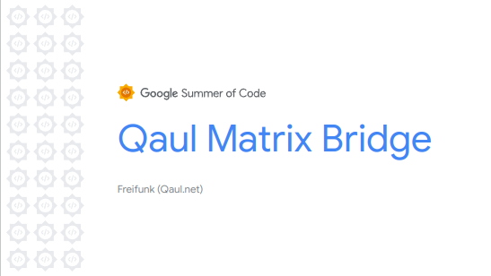
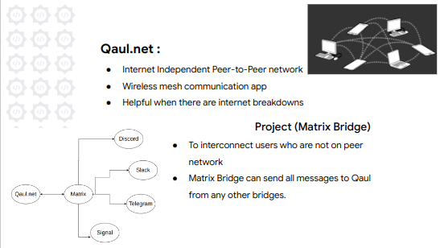
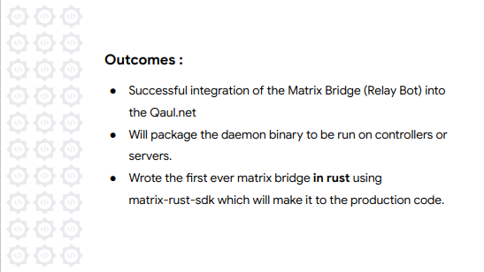

# Google Summer of Code Lightening Talks

Starting from this year, Google has started an event where the Google Summer of Code contributors from various organisations would show up in an presentation and give a 3-min session about how beautiful their journey had been with the program.

I too applied for this Lightening Talk session to talk about my project and I was lucky enough to get selected as one of the 36 contributor out of 106 applications received for the talk. To be honest it was pure luck since they have mentioned that they have randomly selected the contributors. 

On 19th Sept 2023, I have given my talk for 3 mins. You can find my slides below for my explaination about my work within 3 mins and my experience.

And I am too happy to appreciate `Google Open Source` organization to give me a gift for the lightening talk session. XD This year's contributors teased a lot to google about giving us swags or T-Shirt and they finally gave after the talk. There were options among many different items but I choosed an Insulated Travel Tumbler. Looking forward to have my hot/cold drinks into the tumbler.
